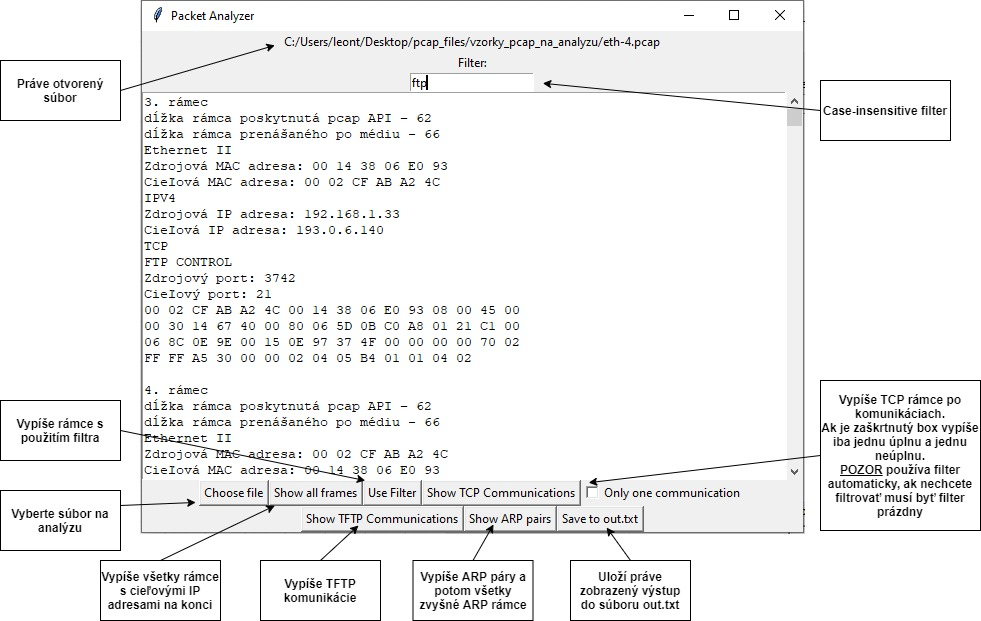
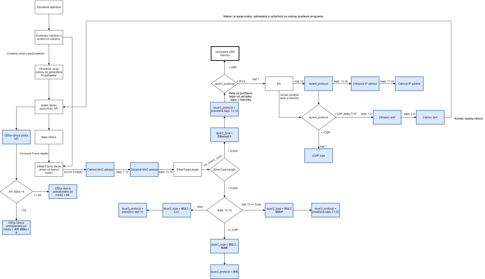

# Packet Analyzer
Tento program umožňuje analýzu packetov z .pcap súborov.

Programovací jazyk : Python 3 \
Spúštať cez GUI.py 

Program sa spúšťa štandartne cez command line: 
	`python GUI.py`

Po spustení treba vybrať pcap súbor, ktorý ideme analyzovať, 
tlačidlom "Choose File".
## Používateľská príručka

## Vývojový diagram
